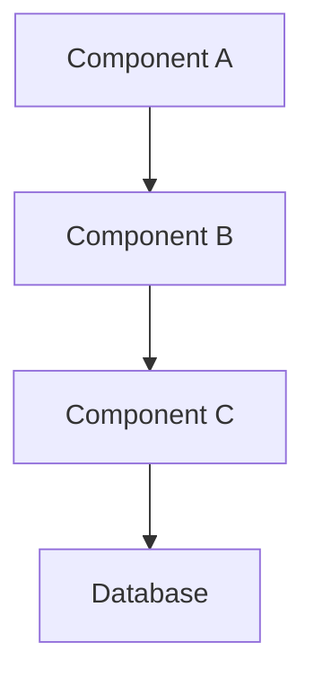

# [Component/Feature Name]

## Metadata

- **Author**: [Author Name]
- **Created**: [YYYY-MM-DD]
- **Last Updated**: [YYYY-MM-DD]
- **Version**: [X.Y.Z]
- **Status**: [Draft/Review/Approved]
- **Architecture**: [ARM64/x64/Cross-platform]

## Overview

### Purpose

[Brief description of what this component/feature does and why it exists]

### Plain English Explanation

[Explain the concept in simple terms that a non-technical person could understand]

### Key Concepts

- Concept 1: [Explanation]
- Concept 2: [Explanation]
- Concept 3: [Explanation]

## Technical Details

### Architecture



### Dependencies

| Dependency | Version | Purpose | Architecture |
|------------|---------|---------|--------------|
| dependency1 | v1.2.3 | Purpose description | ARM64 |
| dependency2 | v2.3.4 | Purpose description | x64† |

† Runs via Windows x64 emulation

### Performance Considerations

- [ ] Async operations
- [ ] Caching strategy
- [ ] Memory management
- [ ] ARM64 optimizations

### Security

- [ ] Authentication requirements
- [ ] Authorization rules
- [ ] Data encryption
- [ ] Input validation

## Implementation

### Code Example

```typescript
// Example implementation
function exampleFunction() {
    // Implementation details
}
```

### Usage Example

```typescript
// How to use the component/feature
const result = exampleFunction();
```

### Configuration

```json
{
  "setting1": "value1",
  "setting2": "value2"
}
```

## Best Practices

### Do's

- ✅ Best practice 1
- ✅ Best practice 2
- ✅ Best practice 3

### Don'ts

- ❌ Anti-pattern 1
- ❌ Anti-pattern 2
- ❌ Anti-pattern 3

## Common Patterns

### Pattern 1: [Pattern Name]

```typescript
// Pattern implementation
```

**When to use:**

- Use case 1
- Use case 2

**Benefits:**

- Benefit 1
- Benefit 2

### Pattern 2: [Pattern Name]

```typescript
// Pattern implementation
```

## Edge Cases & Limitations

### Known Limitations

1. Limitation 1
2. Limitation 2

### Edge Cases

1. Edge case 1
   - Handling strategy
   - Example code
2. Edge case 2
   - Handling strategy
   - Example code

## Performance Optimization

### Benchmarks

| Scenario | Performance Target | Actual Performance |
|----------|-------------------|-------------------|
| Scenario 1 | Target metric | Actual metric |
| Scenario 2 | Target metric | Actual metric |

### Optimization Techniques

1. Technique 1

   ```typescript
   // Optimization example
   ```

2. Technique 2

   ```typescript
   // Optimization example
   ```

## Troubleshooting

### Common Issues

1. Issue 1
   - Symptoms
   - Cause
   - Solution

   ```typescript
   // Solution example
   ```

2. Issue 2
   - Symptoms
   - Cause
   - Solution

   ```typescript
   // Solution example
   ```

## Testing

### Unit Tests

```typescript
describe('Component', () => {
    it('should behave correctly', () => {
        // Test implementation
    });
});
```

### Integration Tests

```typescript
describe('Integration', () => {
    it('should work with other components', () => {
        // Test implementation
    });
});
```

## Maintenance

### Monitoring

- [ ] Key metrics to monitor
- [ ] Alert thresholds
- [ ] Logging requirements

### Updates

- [ ] Update procedure
- [ ] Rollback procedure
- [ ] Version compatibility

## Related Resources

### Internal Documentation

- [Link to related doc 1]
- [Link to related doc 2]

### External Resources

- [Link to external resource 1]
- [Link to external resource 2]

## Version History

| Version | Date | Changes | Author |
|---------|------|---------|---------|
| 1.0.0 | YYYY-MM-DD | Initial version | Author |
| 1.1.0 | YYYY-MM-DD | Added feature X | Author |

## Notes

### Architecture-Specific Notes

- ARM64 considerations
- x64 emulation notes
- Cross-platform compatibility

### Future Considerations

- [ ] Planned improvements
- [ ] Future integrations
- [ ] Scalability considerations

---
*Last updated: [YYYY-MM-DD]*
