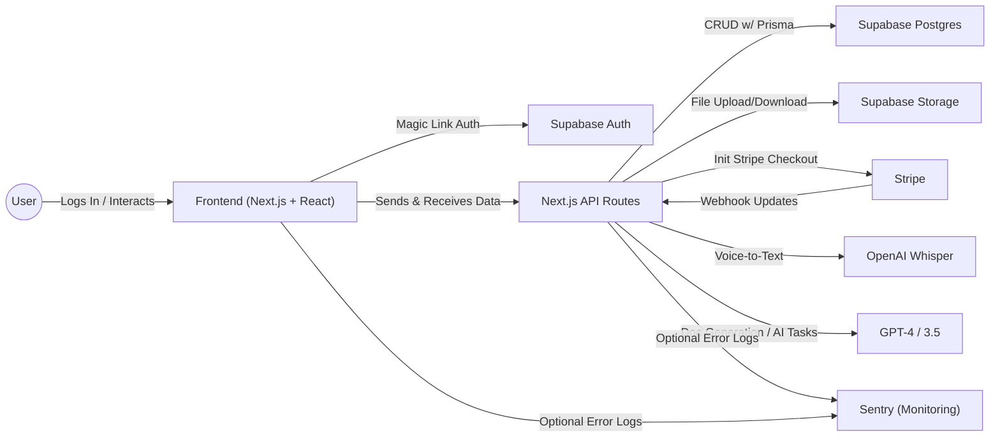
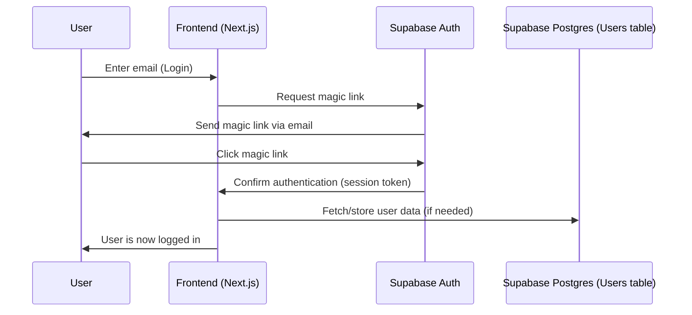
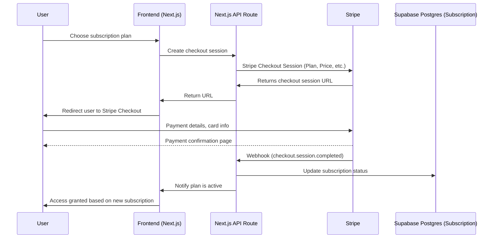
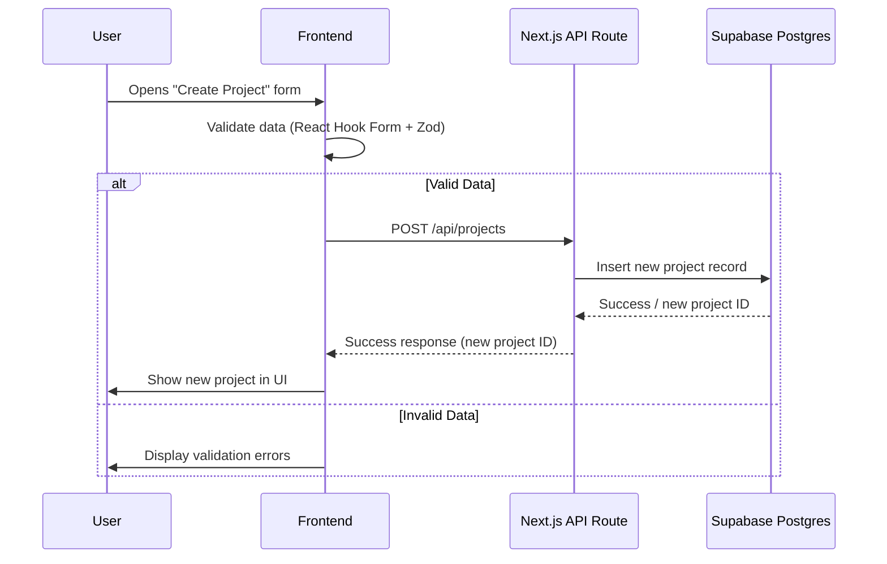
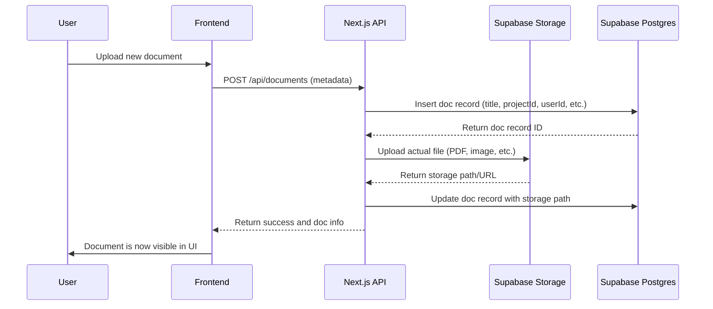
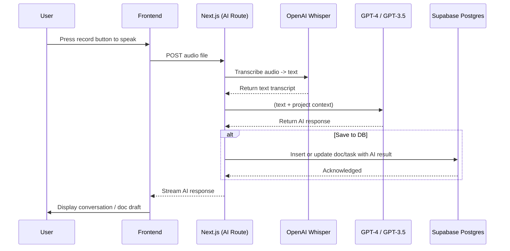
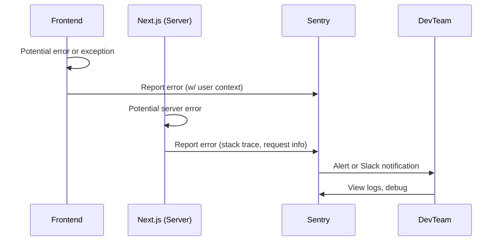
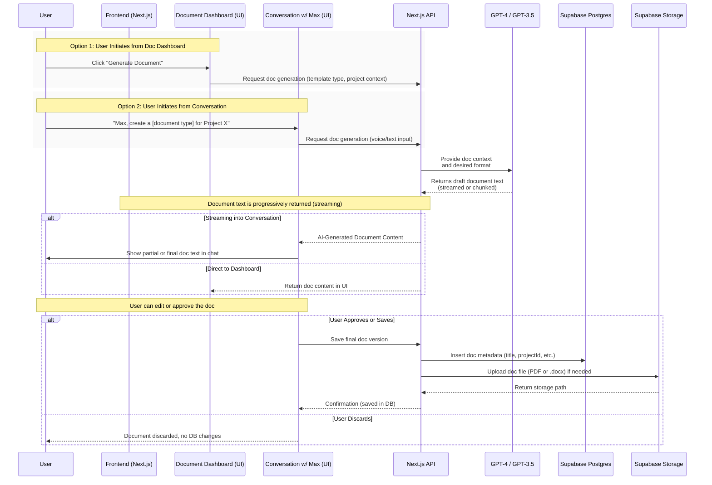
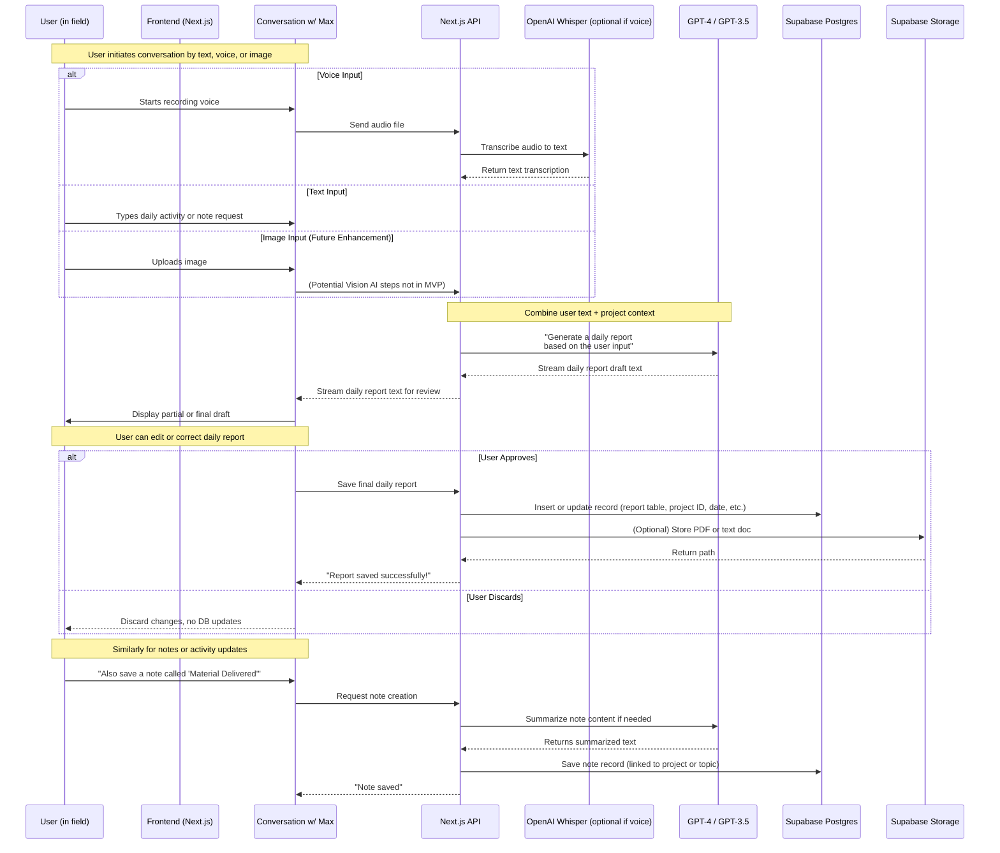
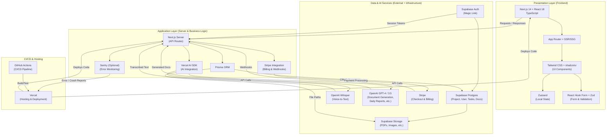

# File Structure Template

You are tasked with optimizing the file structure for a web app project. Your goal is to create an improved, minimal file structure based on the current structure and the provided context. Follow these instructions carefully:

1. Review the current file structure:
<current_structure>
{{CURRENT_STRUCTURE}}
</current_structure>

2. Examine the context files:
<context>

<prd.md>

## Product Requirements Document (PRD)

### Product Overview

#### Purpose

Constructiv AI aims to streamline construction processes through AI-powered tools, focusing on improving efficiency and workflow management for small to midsize construction businesses.

### Target Users

- Construction Project Managers
- Site Supervisors
- Construction Company Owners
- Field Workers
- Administrative Staff

## Features and Functionality

### Core Features (MVP)

1. Project Management
   - **Project Creation and Setup**
     - Create projects with essential details (name, address, start/end dates)
     - Upload and attach initial project documents
     - Set basic project milestones and phases
     - Define project team members and roles

   - **Project Tracking**
     - Visual progress indicators for each phase
     - Basic budget tracking (planned vs. actual)
     - Simple milestone tracking with status updates
     - Project timeline visualization

   - **Resource Management**
     - Basic team member allocation to projects
     - Simple equipment and material tracking
     - Basic availability calendar
     - Resource conflict detection

2. Task Management
   - **Task Creation and Organization**
     - Create, edit, and delete tasks with descriptions
     - Set task categories (pre-construction, construction, administrative)
     - Add attachments and references to tasks
     - Create subtasks and checklists

   - **Task Assignment and Tracking**
     - Assign tasks to team members
     - Set priority levels (Low, Medium, High, Urgent)
     - Define due dates and estimated completion times
     - Track dependencies between tasks

   - **Task Views**
     - Kanban board for visual task management
     - List view with sorting and filtering
     - Calendar view for deadline tracking
     - Basic Gantt chart for timeline visualization

   - **Status Management**
     - Update task status (Not Started, In Progress, Under Review, Completed)
     - Track completion percentage
     - Add progress notes and comments
     - Basic blocking issue identification

3. Document Management
   - **Document Types**
     - Construction Documents
       - Standard contracts and agreements
       - Change orders and proposals
       - Safety and quality control documents
       - Project handover materials
       - Warranty documentation
       - Template customization options

     - Project Reports
       - Daily progress tracking
       - Site inspections
       - Safety incidents
       - Quality control reports
       - Resource utilization reports
       - Weather impact reports
       - Delay notifications
       - Budget status updates
       - Real-time streaming interface

     - Field Notes
       - Voice memos and observations
       - Meeting minutes
       - Task reminders
       - Issue documentation
       - Photo annotations
       - Location-tagged notes
       - Time stamps
       - Project context linking

   - **Image Processing & Capture**
     - Snap-and-process for handwritten notes
     - AI-powered text extraction
     - Smart document classification
     - Image thumbnail generation
     - Original image preservation for audit
     - Multi-page support
     - Mobile capture optimization
     - Image enhancement capabilities
     - Batch processing support

   - **Organization & Access**
     - Hierarchical folder structure
     - Version control system
     - Full-text search capability
     - Permission management
     - Mobile accessibility
     - Offline capabilities
     - Quick preview mode
     - Export options
     - Audit trail tracking

4. AI Assistant (Max)
   - **Voice Interaction**
     - High-quality voice-to-text transcription
     - Natural language command processing
     - Voice command history
     - Multiple accent and language support

   - **Project Context Awareness**
     - Access to project details and status
     - Understanding of project timeline and phases
     - Recognition of team members and roles
     - Awareness of document templates and types

   - **Document Generation**
     - Create documents from voice commands
     - Fill in templates with project data
     - Generate meeting minutes and notes
     - Create basic reports and summaries
     - Smart template selection
     - Context-aware field population
     - Format validation

   - **Task Management**
     - Create tasks from voice commands
     - Set reminders and follow-ups
     - Check task status and updates
     - Assign tasks to team members

   - **Information Retrieval**
     - Quick answers to project queries
     - Find relevant documents and information
     - Provide project status updates
     - Access contact information and details

5. Authentication & User Management
   - **User Authentication**
     - Secure email-based magic link login
     - Multi-factor authentication option
     - Session management and timeout
     - Password-less authentication

   - **User Profiles**
     - Basic user information and contact details
     - Profile picture and role designation
     - Skills and expertise listing
     - Project assignment history

   - **Access Control**
     - Role-based permissions (Admin, Manager, Team Member)
     - Project-level access control
     - Document sharing permissions
     - Feature access restrictions

   - **Activity Tracking**
     - User login and session history
     - Document access and modification logs
     - Task creation and updates tracking
     - Basic audit trail for compliance

### User Requirements

- Intuitive interface suitable for construction professionals
- Mobile-first design for on-site usage
- Offline capability for remote sites
- Quick data entry and retrieval
- Ability to capture and process handwritten notes
- Support for hybrid digital-physical workflows
- Mobile-optimized document capture
- Quick access to frequently used templates
- Flexible document organization

## Technical Requirements

### Platform Requirements

- Web-based application
- Mobile responsive design
- Cross-platform compatibility

### Technical Stack

1. Frontend & Backend:
   - Next.js 14 (App Router) + React 18
   - TypeScript for type safety
   - Tailwind CSS & shadcn/ui for UI
   - Zustand for state management
   - React Query for data caching
   - React Hook Form + Zod
   - Stripe.js for payments

2. Data & Infrastructure:
   - Supabase (Postgres, Auth, Storage)
   - Prisma ORM
   - Vercel AI SDK
   - OpenAI (Whisper & GPT)

3. DevOps:
   - Vercel hosting
   - GitHub Actions CI/CD
   - Optional Sentry monitoring

### Performance Requirements

- Page load time < 3 seconds
- Real-time updates
- Offline data synchronization

### Security Requirements

- Role-based access control
- Data encryption
- Secure file storage
- Compliance with construction industry standards

## Success Metrics

- User adoption rate
- Time saved per project
- Error reduction in documentation
- Resource utilization improvement

## Timeline and Phases

1. Phase 1: Core Platform Development
2. Phase 2: AI Integration
3. Phase 3: Advanced Features
4. Phase 4: Industry-Specific Optimizations

## Constraints and Dependencies

- Integration with existing construction software
- Internet connectivity at construction sites
- User technical proficiency
- Industry regulations and compliance

## Future Considerations

- Advanced AI features
- Additional integrations
- Expanded mobile capabilities
- International market adaptation

</prd.md>

<feature-roadmap.md>

# Constructiv AI Feature Roadmap

## Project Description

Constructiv AI is building an intuitive AI-powered construction management platform designed specifically for small to midsize builders. The platform's centerpiece is **Max**, an AI assistant that understands voice input and helps eliminate manual, time-consuming administrative burdens of running a construction business.

The platform serves as a single source of truth for all construction-related activities, reducing the need for multiple disconnected tools. Through voice commands, users can quickly generate standardized construction project documents, reports, and communications, significantly reducing administrative workload while improving accuracy and user experience.

Key Value Propositions:

- Voice-driven, AI-powered project management
- Seamless integration into existing workflows
- Centralized information management
- Proactive insights and recommendations
- Modular and customizable framework

## Technology Stack

### Frontend & Backend

- **Next.js 14** (App Router)
- **React 18**
- **TypeScript** for type safety
- **Tailwind CSS** & **shadcn/ui** for styling/UI components
- **Zustand** for light state management
- **React Query** (@tanstack/react-query) for server data caching
- **React Hook Form + Zod** for form handling & validation
- **Prisma ORM** for database management
- **Stripe.js** (@stripe/stripe-js) for client-side checkout

### Data & Auth

- **Supabase**
  - Postgres database for projects, documents, and user data
  - Authentication (magic link)
  - Storage for generated PDFs

### AI Services

- **OpenAI Whisper** for voice-to-text transcription
- **OpenAI GPT-4/3.5** for conversational responses and document drafting
- **Vercel AI SDK** for AI integration and streaming responses
- **OpenAI Assistant** for advanced conversational capabilities

### CI/CD & Hosting

- Hosted on **Vercel**
- **GitHub Actions** for linting, testing, and CI
- **Sentry** for error tracking (optional at MVP stage)

This document outlines the features planned for Constructiv AI, separated into MVP features and future enhancements.

## MVP Features (Current Development)

### 1. Project Management

- **Project Creation and Setup**
  - Create new projects with essential details (name, address, start/end dates)
  - Upload and attach initial project documents
  - Set basic project milestones and phases
  - Define project team members and roles

- **Project Tracking**
  - Visual progress indicators for each project phase
  - Basic budget tracking (planned vs. actual)
  - Simple milestone tracking with status updates
  - Project timeline visualization

- **Resource Management**
  - Basic team member allocation to projects
  - Simple equipment and material tracking
  - Basic availability calendar
  - Resource conflict detection

### 2. Task Management

- **Task Creation and Organization**
  - Create, edit, and delete tasks with descriptions
  - Set task categories (pre-construction, construction, administrative)
  - Add attachments and references to tasks
  - Create subtasks and checklists

- **Task Assignment and Tracking**
  - Assign tasks to team members
  - Set priority levels (Low, Medium, High, Urgent)
  - Define due dates and estimated completion times
  - Track dependencies between tasks

- **Task Views**
  - Kanban board for visual task management
  - List view with sorting and filtering
  - Calendar view for deadline tracking
  - Basic Gantt chart for timeline visualization

- **Status Management**
  - Update task status (Not Started, In Progress, Under Review, Completed)
  - Track completion percentage
  - Add progress notes and comments
  - Basic blocking issue identification

### 3. Document Management

- **Document Organization**
  1. Construction Documents
     - Standard contract templates
     - Change orders and proposals
     - Subcontractor agreements
     - Safety plans and checklists
     - Project handover documents
     - Warranty documentation
     - Version control with approval workflow
     - Template customization options

  2. Project Reports
     - Daily progress reports
     - Site inspection reports
     - Safety incident reports
     - Quality control reports
     - Resource utilization reports
     - Weather impact reports
     - Delay notifications
     - Budget status updates
     - Real-time streaming interface
     - Voice/image capture integration
- **AI-Assisted Generation**
  - Convert voice notes to document drafts
  - Generate common construction documents from templates
  - Auto-fill project details in documents
  - Basic document formatting and styling
  
  3. Field Notes
     - Quick voice memos
     - Site observations
     - Meeting minutes
     - Task reminders
     - Issue documentation
     - Photo annotations
     - Location tagging
     - Time stamps
     - Project context linking

- **Image Capture & Processing**
  - Snap-and-process functionality for handwritten notes
  - AI-powered text extraction from images
  - Smart document classification
  - Automatic template matching
  - Image thumbnail generation
  - Original image preservation for audit
  - Multi-page document support
  - Image enhancement for better readability
  - Batch image processing

- **Common Features Across Types**
  - Hierarchical folder structure
  - Version control system
  - AI-assisted generation
  - Full-text search capability
  - Sharing and collaboration
  - Template management
  - Mobile optimization
  - Offline access support
  - Quick preview mode
  - Export options
  - Access control
  - Audit trail tracking

- **Search and Retrieval**
  - Full-text search across documents
  - Filter by document type, date, and project
  - Quick preview of document contents
  - Basic document sharing capabilities
- **Mobile Integration**
  - Native camera integration
  - Image optimization
  - Offline image queuing
  - Background upload
  - Real-time preview
  - Edit before upload
  - Multiple capture modes

### 4. AI Assistant (Max)

- **Voice Interaction**
  - High-quality voice-to-text transcription
  - Natural language command processing
  - Voice command history
  - Multiple accent and language support

- **Project Context Awareness**
  - Access to project details and status
  - Understanding of project timeline and phases
  - Recognition of team members and roles
  - Awareness of document templates and types

- **Document Generation**
  - Create documents from voice commands
  - Fill in templates with project data
  - Generate meeting minutes and notes
  - Create basic reports and summaries

- **Task Management**
  - Create tasks from voice commands
  - Set reminders and follow-ups
  - Check task status and updates
  - Assign tasks to team members

- **Information Retrieval**
  - Quick answers to project queries
  - Find relevant documents and information
  - Provide project status updates
  - Access contact information and details

### 5. Authentication & User Management

- **User Authentication**
  - Secure email-based magic link login
  - Multi-factor authentication option
  - Session management and timeout
  - Password-less authentication

- **User Profiles**
  - Basic user information and contact details
  - Profile picture and role designation
  - Skills and expertise listing
  - Project assignment history

- **Access Control**
  - Role-based permissions (Admin, Manager, Team Member)
  - Project-level access control
  - Document sharing permissions
  - Feature access restrictions

- **Activity Tracking**
  - User login and session history
  - Document access and modification logs
  - Task creation and updates tracking
  - Basic audit trail for compliance

## Future Features (Post-MVP)

### 1. Advanced Project Management

- Advanced risk management
- Automated project health scoring
- Change order management
- Complex resource optimization
- Advanced timeline management
- Multi-project portfolio management

### 2. Enhanced Task Management

- Advanced task dependencies
- Automated task sequencing
- Resource leveling
- Time tracking integration
- Advanced progress analytics
- Custom workflow automation

### 3. Comprehensive Document Management

- Real-time collaborative editing
- E-signature integration
- Advanced document workflows
- Cloud storage integration
- OCR for scanned documents
- Advanced search with AI
- Document analytics
- Automated compliance checking

### 4. Team Collaboration

- In-app messaging
- Video conferencing
- Team forums
- Knowledge base
- Performance tracking
- Resource availability management
- Cross-project collaboration tools

### 5. Advanced Calendar & Scheduling

- Resource availability optimization
- Multi-calendar integration
- Automated scheduling
- Conflict detection
- Mobile calendar sync
- Weather integration
- Site visit scheduling

### 6. Analytics & Reporting

- Custom report builder
- Interactive dashboards
- Predictive analytics
- Financial forecasting
- Resource utilization analytics
- Performance benchmarking
- Export capabilities

### 7. CRM & Client Management

- Client portal
- Lead tracking
- Opportunity management
- Contract management
- Client communication tools
- Automated client reporting
- Integration with external CRM

### 8. Resource Management

- Equipment tracking
- Material management
- Supplier management
- Procurement automation
- Subcontractor management
- Cost tracking
- Inventory management

### 9. Enhanced AI Capabilities (Max Tool Kits) (Packages)

#### Project Management Package

- Project health analysis and risk assessment
- Timeline optimization suggestions
- Change order impact analysis
- Resource allocation recommendations
- Automated progress reporting
- Project delay predictions and mitigation strategies

#### Financial Package

- Budget tracking and analysis
- Cost estimation and forecasting
- Invoice processing and validation
- Payment schedule optimization
- Financial risk assessment
- Cash flow predictions
- Expense categorization and analysis

#### Subcontractor Package

- Subcontractor performance analysis
- Work quality assessment
- Schedule coordination
- Payment tracking
- Documentation verification
- Compliance monitoring
- Communication management

#### Personnel Package

- Team performance analytics
- Skills gap analysis
- Training recommendations
- Workload optimization
- Schedule management
- Time tracking analysis
- Safety compliance monitoring

#### Supplier Management Package

- Vendor performance tracking
- Material delivery optimization
- Inventory level monitoring
- Price comparison analysis
- Order scheduling
- Quality control tracking
- Supplier relationship scoring

#### Documentation Package

- Advanced document generation
- Contract analysis and review
- Compliance verification
- Document classification
- Content extraction and analysis
- Template customization
- Version comparison

#### Client Relations Package

- Client communication analysis
- Satisfaction monitoring
- Meeting summary generation
- Follow-up task creation
- Issue tracking and resolution
- Progress report generation
- Client feedback analysis

#### Quality Control Package

- Inspection scheduling
- Defect tracking and analysis
- Quality metrics monitoring
- Compliance verification
- Issue resolution tracking
- Standard enforcement
- Audit preparation

#### Safety and Compliance Package

- Safety incident analysis
- Regulation compliance checking
- Permit status monitoring
- Certification tracking
- Risk assessment
- Training requirement tracking
- Safety report generation

#### Analytics and Reporting Package

- Custom report generation
- Data visualization
- Trend analysis
- Performance metrics
- Predictive analytics
- Business intelligence
- KPI monitoring

#### Site Operations Package

- Weather impact analysis
- Equipment utilization tracking
- Site condition monitoring
- Progress photography management
- Location-based task coordination
- Material logistics optimization
- Site safety monitoring

#### Communication Package

- Meeting scheduling and management
- Communication channel optimization
- Stakeholder update generation
- Team collaboration monitoring
- Decision tracking
- Action item follow-up
- Communication effectiveness analysis

### 10. Mobile & Field Operations

- Native mobile apps
- Offline capabilities
- Field data collection
- Photo/video documentation
- GPS tracking
- Mobile forms
- Real-time updates

### 11. Compliance & Safety

- Regulatory compliance tracking
- Safety incident reporting
- Permit management
- Certification tracking
- Environmental monitoring
- Audit trail
- Risk assessment tools

### 12. Advanced User Features

- Skill tracking
- Professional development
- Custom dashboards
- Advanced notifications
- Time tracking
- Personal task management
- Activity analytics

### 8. Document & Note Solutions

- **Custom Printables Marketplace**
  - Branded note templates
  - Custom form designs
  - Industry-specific templates
  - Company-branded materials
  - Bulk ordering options
  - Print-on-demand service
  - Digital-physical hybrid workflows

- **Advanced Image Processing**
  - Machine learning-based handwriting recognition
  - Smart form field detection
  - Automated data extraction
  - Historical document analysis
  - Pattern recognition
  - Quality scoring system

- **Template Management**
  - Template analytics
  - Usage tracking
  - Performance metrics
  - A/B testing capabilities
  - Template recommendation engine

- **Integration Features**
  - Print shop API integration
  - Shipping service integration
  - Bulk processing capabilities
  - Custom branding options
  - Material selection
  - Pricing optimization

- **Revenue Opportunities**
  - Subscription-based template access
  - Custom template design services
  - Bulk printing services
  - Premium paper options
  - Rush delivery services
  - White-label solutions
  - Enterprise customization

## Implementation Timeline

1. **Phase 1 (MVP)**: Q1 2025
   - Core features implementation
   - Basic AI integration
   - Essential project management

2. **Phase 2**: Q2-Q3 2025
   - Enhanced AI capabilities
   - Advanced document management
   - Mobile app development

3. **Phase 3**: Q4 2025
   - Analytics and reporting
   - Advanced collaboration tools
   - CRM integration

4. **Phase 4**: 2026
   - Compliance and safety
   - Advanced resource management
   - Industry-specific optimizations

</feature-roadmap.md>

<core-requirements.md>

# Core Requirements for Constructiv AI Platform

## Functional Requirements

### Authentication & User Management (AUTH)

- REQ-AUTH-1: Implement email-based passwordless authentication using magic links
- REQ-AUTH-2: Provide role-based access control with custom permissions
- REQ-AUTH-3: Track user activity and maintain audit logs
- REQ-AUTH-4: Enable users to access their projects, tasks, tools, and company information
- REQ-AUTH-5: Allow users to view their standard operating procedures and project documentation

### AI Assistant Integration (AI)

- REQ-AI-1: Implement voice-to-text transcription using OpenAI Whisper with <10s response time
- REQ-AI-2: Enable context-aware chat interface with project-specific conversations
- REQ-AI-3: Provide real-time streaming responses from AI assistant (Max)
- REQ-AI-4: Support automated documentation generation based on voice commands
- REQ-AI-5: Enable Max to retrieve and populate document templates with project data
- REQ-AI-6: Implement conversation history and search functionality

### Project Management (PM)

- REQ-PM-1: Support project CRUD operations with essential fields (name, address, start date)
- REQ-PM-2: Provide multiple view modes (Grid, List, Kanban)
- REQ-PM-3: Enable project status tracking and milestone management
- REQ-PM-4: Implement budget and timeline oversight capabilities
- REQ-PM-5: Support custom project thumbnails and background color themes

### Task Management (TM)

- REQ-TM-1: Enable task creation, assignment, and status tracking
- REQ-TM-2: Support task dependencies and sub-tasks
- REQ-TM-3: Implement multiple task views (timeline, kanban, list, calendar, gantt)
- REQ-TM-4: Enable task grouping into processes
- REQ-TM-5: Support priority levels and due date management
- REQ-TM-6: Allow task submission to Max for review and approval

### Document Management (DOC)

- REQ-DOC-1: Document Type Support
  - Construction Documents: contracts, proposals, agreements
  - Project Reports: daily progress, inspections, incidents
  - Field Notes: voice memos, observations, meeting minutes

- REQ-DOC-2: Template Management
  - Implement version-controlled template system
  - Support template customization
  - Enable AI-powered template matching
  - Maintain template analytics

- REQ-DOC-3: Image Processing
  - Enable snap-and-process for handwritten notes
  - Implement AI-powered text extraction
  - Support multi-page document capture
  - Generate and store image thumbnails
  - Preserve original images for audit

- REQ-DOC-4: Document Generation & Processing
  - AI-powered document classification (95% accuracy)
  - OCR for scanned documents
  - Voice-to-document conversion
  - Auto-population of project data
  - Real-time collaborative editing

- REQ-DOC-5: Mobile Integration
  - Native camera integration
  - Offline image capture and queuing
  - Background upload capability
  - Real-time preview and editing
  - Multiple capture modes

- REQ-DOC-6: Organization & Access
  - Hierarchical folder structure
  - Document sharing with permissions
  - Full-text search across all document types
  - Batch upload/download functionality
  - Quick preview capabilities

- REQ-DOC-7: Audit & Compliance
  - Version control for all document types
  - Activity logging and tracking
  - Access control and permissions
  - Audit trail maintenance
  - Document retention policies

## Non-Functional Requirements

### Performance (PERF)

- REQ-NFR-1: Voice transcription response within 10 seconds for <1 min audio clips
- REQ-NFR-2: Document generation completion within 5-10 seconds after confirmation
- REQ-NFR-3: Maintain 99% system uptime during MVP testing

### Security (SEC)

- REQ-NFR-4: Implement secure HTTPS communication
- REQ-NFR-5: Ensure data encryption at rest and in transit
- REQ-NFR-6: Implement secure session management

### Scalability (SCAL)

- REQ-NFR-7: Support initial MVP user load (<50 users)
- REQ-NFR-8: Design architecture for future scaling capabilities
- REQ-NFR-9: Implement modular microservices framework for feature expansion

### Mobile Experience (MOB)

- REQ-NFR-10: Provide native-like mobile experience
- REQ-NFR-11: Support offline capabilities
- REQ-NFR-12: Enable push notifications
- REQ-NFR-13: Optimize UI for mobile touch gestures

Requirements focus on:

- Core platform functionality and AI integration
- Essential project and task management features
- Document handling and generation capabilities
- Performance and security considerations
- Mobile-first design approach
- Scalability for future growth

All requirements are designed to be clear, measurable, and actionable while supporting the platform's goal of streamlining construction management processes.

</core-requirements.md>

<app-stack-data-flow>
# App Stack Data Flow

```scss
┌──────────────────────────────────────────────────────────────────────────────────────────────────┐
│                                    CLIENT (Next.js + React)                                    │
│  1) Next.js 14 (App Router) + React 18 + TypeScript                                           │
│  2) Tailwind CSS + shadcn/ui (UI & Styling)                                                    │
│  3) Zustand (Light State Management)                                                           │
│  4) React Query (@tanstack/react-query) (Server Data Caching)                                  │
│  5) React Hook Form + Zod (Form & Validation)                                                  │
│  6) Stripe.js (@stripe/stripe-js) (Client-side Checkout Redirect)                              │
│                                                                                                │
│    -- User Actions & Input -->                                                                 │
│       - CRUD requests go to Next.js API routes, Prisma, Supabase (Postgres)                    │
│       - AI/Voice commands call Vercel AI SDK (OpenAI GPT/Whisper)                              │
│       - Payment/Subscription flows launch Stripe Checkout from client                          │
│                                                                                                │
└──────────────────────────────────────────────────────────────────────────────────────────────────┘

┌──────────────────────────────────────────────────────────────────────────────────────────────────┐
│                                   SERVER (Next.js Backend)                                     │
│  1) Next.js 14 (API Routes & Server Components)                                                │
│  2) TypeScript (Strict Type Safety)                                                            │
│  3) Prisma (ORM, Migrations)                                                                   │
│  4) Supabase                                                                                   │
│     • Postgres DB (Projects, Tasks, Docs, Users)                                               │
│     • Auth (Magic Link)                                                                        │
│     • Storage (Generated PDFs, Media)                                                          │
│  5) Vercel AI SDK (Integration w/ OpenAI GPT & Whisper)                                        │
│  6) Stripe (Server-side Payment Logic)                                                         │
│     • Checkout Sessions & Billing                                                              │
│     • Webhooks (Subscription status updates)                                                   │
│  7) Optional Sentry (Monitoring & Error Tracking)                                              │
└──────────────────────────────────────────────────────────────────────────────────────────────────┘

┌──────────────────────────────────────────────────────────────────────────────────────────────────┐
│                                   CI/CD & HOSTING & MONITORING                                 │
│  - Vercel (Hosting & Serverless Deployment)                                                    │
│  - GitHub Actions (CI/CD: Lint, Test, Build)                                                   │
│  - (Optional) Sentry for error reporting / performance                                         │
└──────────────────────────────────────────────────────────────────────────────────────────────────┘

```

## Diagram Explanation (Layer by Layer)

### 1. **Presentation Layer (Frontend)**

1. **Next.js 14 + React 18 + TypeScript**
    - Your primary framework for building **server-side rendered** (SSR), **static**, and **client-side** React pages in one codebase.
    - **TypeScript** adds strong type safety.
2. **App Router + SSR/SSG**
    - Leveraging Next.js **App Router** for route definitions, file-based routing, and improved data-fetching patterns.
    - **SSR/SSG** capabilities for better performance and SEO.
3. **Tailwind CSS + shadcn/ui**
    - **Tailwind** for utility-first styling; **shadcn/ui** for a consistent UI component library.
    - Enables rapid UI development with a cohesive design system.
4. **Zustand (Local State)**
    - Manages ephemeral UI state (e.g., modal toggles, voice record states) without the overhead of Redux.
    - Maintains minimal, predictable local or global state.
5. **React Hook Form + Zod**
    - **React Hook Form** to manage form state and reduce re-renders.
    - **Zod** for runtime validation—ensuring that all user inputs conform to the expected schema before hitting the backend.
6. **React Query (@tanstack/react-query)**
    - Handles server state management and caching.
    - Provides automatic background revalidation and optimistic updates.

---

### 2. **Application Layer (Server & Business Logic)**

1. **Next.js Server (API Routes)**
    - Central hub for backend logic, handling requests for:
        - **Project/Task** CRUD
        - **Document** generation or retrieval endpoints
        - **Payment** and subscription setups, etc.
    - Offers server-side rendering for pages, while also hosting serverless API endpoints.
2. **Prisma ORM**
    - Interfaces with **Supabase Postgres**, generating **type-safe** database queries and migrations.
    - Maps your data models (e.g., `Project`, `Task`, `User`, `Document`) in a single `schema.prisma` file.
3. **Vercel AI SDK (AI Integration)**
    - Acts as a wrapper to streamline communication with **OpenAI** (Whisper, GPT).
    - Facilitates **streaming** responses back to the frontend in real time for conversational features (voice or text).
4. **Stripe Integration (Billing & Webhooks)**
    - Manages subscription flows, plan upgrades, and payment methods.
    - **Webhooks** from Stripe update user subscription status in your Postgres database (via Prisma).
5. **Sentry (Optional Error Monitoring)**
    - Captures and logs exceptions and performance metrics across both frontend and backend.
    - Helps diagnose production issues quickly.

---

### 3. **Data & AI Services (External + Infrastructure)**

1. **Supabase Auth (Magic Link)**
    - Handles **password-less** login.
    - Issues and verifies session tokens used by your Next.js server to authenticate user requests.
2. **Supabase Postgres (Projects, Users, Tasks, Docs)**
    - **Primary relational database** for all application data: user profiles, project records, tasks, doc references, etc.
3. **Supabase Storage (PDFs, Images, etc.)**
    - Object storage for storing media files: generated PDFs, images, or any other attachments.
    - You store references to these files in Postgres.
4. **OpenAI Whisper**
    - Provides **voice-to-text** transcription for any audio input from the user.
    - The server calls this service whenever voice commands or recorded notes are uploaded.
5. **OpenAI GPT-4 / GPT-3.5**
    - **Generates** content such as daily reports, project documents, or proposals.
    - Combined with your **project context** to create relevant, domain-specific outputs.
6. **Stripe**
    - Handles **payment and subscription** details.
    - **Secure checkout** is initiated by your Next.js server, and **webhooks** update your database.

---

### 4. **CI/CD & Hosting**

1. **Vercel (Hosting & Deployment)**
    - Automatically **builds and deploys** your Next.js project upon commits to your main branch (or designated branch).
    - Hosts both the **frontend** (Next.js pages) and the **backend** (API routes) in a serverless fashion.
2. **GitHub Actions (CI/CD Pipeline)**
    - Runs **linting, tests, and build checks** on each pull request or commit.
    - If checks pass, the code is deployed to **Vercel**.
    - Ensures stable code quality before going live.

---

## Key Benefits of This Architecture

1. **Unified Codebase**: Both **frontend and backend** live in Next.js, making it easier for devs to maintain.
2. **Scalability**: Vercel’s serverless model scales automatically; Prisma + Supabase handle large data volume.
3. **AI Power**: GPT + Whisper integration through Vercel AI SDK allows for **real-time** doc generation, voice commands, and custom AI workflows.
4. **Monetization**: Stripe gives you robust subscription and billing features without handling sensitive payment details.
5. **Security & Compliance**: Magic link auth, role-based data access, and serverless architecture reduce attack surfaces.
6. **Developer Experience**: Tools like **Zod**, **React Hook Form**, **Zustand**, and **Sentry** streamline dev workflows.

## Data Flow

Below is an **updated high-level summary** of the **major data flows** in your Constructiv AI application, now including a **Stripe payment flow**. The goal is to show how data enters, moves through, and is stored across your system for user authentication, project/task management, AI functionality, document management, **and** billing.



---

## 1. User Authentication & Session Flow



1. **User Initiates Login**
    - The user enters their email address on the client (Next.js + React).
    - A request is sent to **Supabase Auth**.
2. **Magic Link Generation**
    - Supabase sends a **magic link** to the user’s email.
    - The user clicks the magic link to confirm identity.
3. **Session Storage**
    - After successful authentication, **Supabase** creates a user session.
    - The session token is stored in the user’s browser (cookies/local storage).
    - The frontend (Next.js) reads the session token to manage the user’s logged-in state.

**End Result**:

- The user is authenticated via a **password-less** login.
- Session information is managed by Supabase and recognized in Next.js.

---

## 2. **Billing & Subscription Flow (Stripe)**



1. **Subscription/Plan Selection**
    - Once logged in, the user selects a **plan** (e.g., monthly or annual subscription).
    - The frontend (Next.js) calls an API route (e.g., `/api/billing/create-session`) to initialize the Stripe checkout session.
2. **Stripe Checkout**
    - The user is redirected to **Stripe**’s secure checkout page.
    - Stripe handles payment collection, card validation, and secure billing details.
3. **Payment Confirmation**
    - After a successful payment, Stripe redirects the user back to your site with a `session_id` or a similar confirmation token.
    - The user’s subscription status is now **active** in Stripe.
4. **Stripe Webhook**
    - Stripe sends **webhook events** (e.g., `checkout.session.completed`, `invoice.payment_succeeded`, `customer.subscription.updated`) to your Next.js webhook endpoint (e.g., `/api/billing/webhook`).
    - The webhook endpoint **validates** the event signature, then updates the user’s subscription info in **Supabase Postgres** (e.g., storing `stripe_customer_id`, `stripe_subscription_id`, and `plan_tier`).
5. **Access Control**
    - The application checks the user’s subscription status in Supabase to enable or limit functionality (e.g., AI usage caps, document generation, etc.).

**End Result**:

- Users can **subscribe** to your platform via Stripe’s secure checkout.
- Payment status, plan details, and subscription metadata are **tracked** in both **Stripe** and **Supabase**.

---

## 3. Project & Task Management Flow



1. **Data Entry** (Frontend)
    - The user opens a form to create or update a **Project** or **Task** in the React/Next.js client.
    - Form validation is handled by **React Hook Form + Zod**.
2. **API Request**
    - After validation, an API call is sent to your **Next.js (App Router) API endpoint** with the relevant project/task data.
3. **Server-Side Processing**
    - The API route receives the request and uses **Prisma** (ORM) to **create or update** a record in **Supabase Postgres**.
    - **Supabase** stores the new or updated project/task data in the database.
4. **Response to Client**
    - The server returns a success or error message to the frontend.
    - If successful, the new or updated data is displayed to the user (e.g., in a project list or task board).

**End Result**:

- Project and Task records are reliably **created, updated, or fetched** from **Supabase Postgres** through your Next.js + Prisma layer.

---

## 4. Document Management Flow



1. **Document Creation**
    - A user wants to create a new document (e.g., a change order, meeting minutes, or invoice).
    - They either fill out a form or use the **AI Assistant** (Max) to generate a draft.
2. **Document Storage**
    - Once a final version (PDF or text file) is ready, it’s **uploaded** to **Supabase Storage**.
    - A record is created in **Postgres** to log the file name, location (bucket/path), and any metadata.
3. **Document Retrieval**
    - Users can retrieve documents via the Document Management UI.
    - Next.js API routes fetch references from **Postgres**, and the actual file is fetched from **Supabase Storage**.
4. **Versioning & Metadata** (MVP Level)
    - You can track **basic version info** (e.g., timestamps, authors) in Postgres.
    - Future expansions might include advanced version history, real-time collaborative editing, etc.

**End Result**:

- Documents are **centrally stored** and **linked** to their projects.
- Team members can **view or download** files with appropriate access permissions.

---

## 5. AI Assistant (Max) Flow



1. **Voice/Command Input** (Client)
    - The user clicks a microphone button (or a text input) in the Next.js frontend.
    - If voice is used, **audio data** is captured locally in the browser.
2. **Transcription Request**
    - The audio blob or buffer is **sent to a Next.js API route** designated for AI transcription.
    - The server calls **OpenAI Whisper** to convert speech to text.
3. **GPT Processing**
    - The transcribed text is then fed into **GPT-4** or **GPT-3.5** (via the **Vercel AI SDK**), along with contextual data:
        - Project ID, user role, existing tasks/documents, etc.
4. **AI Response**
    - GPT-4 generates a response (e.g., **draft document**, **task creation suggestion**, or **project status update**).
    - The server **streams** this response back to the frontend, which updates the user interface in real-time.
5. **Optional Data Storage**
    - Depending on the user’s choice, the GPT-generated content (e.g., a newly drafted document) can be saved to **Supabase Postgres** (structured data) and/or **Supabase Storage** (PDF/Doc file).

**End Result**:

- A near real-time conversation with the AI assistant that can **generate documents**, **update tasks**, or **provide project info**.
- Data can be **persisted** in your Supabase database/storage if needed.

---

## 6. Error Tracking & Monitoring (Optional Sentry)



1. **App-Level Integration**
    - If or when Sentry is set up, you include it in both the Next.js frontend and backend.
    - Any **uncaught errors** or **performance issues** get captured automatically.
2. **User Context**
    - When a logged-in user triggers an error, Sentry logs relevant context (e.g., user ID, project ID).
    - This helps dev teams trace issues in production.
3. **Alerts & Dashboards**
    - Sentry sends you alerts or Slack messages for critical errors.
    - You can see error trends, logs, and stack traces in the Sentry dashboard.

**End Result**:

- Developers can quickly respond to issues, reducing downtime and improving user experience.

## Additional Data Flows

### 7. Document Generation (Dashboard or Conversation w/ Max)



## 8. Daily Reports, Activity Updates, or Notes from Max



## Putting It All Together

---

- **Frontend**: User interfaces in **Next.js + React** gather input, display project/task data, manage UI state with **Zustand**, handle form validation (React Hook Form + Zod), and facilitate Stripe payment flows.
- **Server**: Next.js API routes call **Prisma** to interact with Supabase Postgres, incorporate **OpenAI Whisper** and **GPT** for AI features, and handle Stripe webhooks to keep subscription details updated.
- **Storage & Auth**: **Supabase** manages user sessions (magic link), file storage (PDFs, images), the main Postgres database (projects, tasks, documents), and subscription data (Stripe webhook updates).
- **AI Interactions**: Voice or text commands are transcribed (Whisper), processed by GPT, and returned to the user for real-time AI assistance.
- **Billing**: **Stripe** securely processes payments; the user’s subscription status is updated in Supabase for feature access control.
- **Monitoring**: **Sentry** (optional) provides real-time error and performance monitoring.

These data flows ensure a **secure, scalable** foundation for user onboarding, project management, document generation, AI-driven workflows, and monetization via Stripe.



</app-stack-data-flow>
</context>

3. When creating the optimized file structure, adhere to these guidelines:
   a. Use a consistent directory structure
   b. Separate concerns (UI, business logic, data)
   c. Group related components together
   d. Maintain a clear documentation hierarchy
   e. Emphasize code maintainability, readability, and scalability
   f. Provide clear structure for both code and documentation

4. Create an optimized, minimal file structure based on the current structure and context. Ensure that your new structure addresses the guidelines mentioned above.

5. After creating the optimized structure, provide a brief explanation of the changes you made and how they benefit the project in terms of organization, maintainability, and scalability.

6. Present your response in the following format:
   <optimized_structure>
   [Your optimized file structure here]
   </optimized_structure>

   <explanation>
   [Your explanation of changes and benefits here]

   </explanation>

Remember to keep the structure minimal while addressing all the key aspects of the project. Focus on creating a logical and efficient organization that will support the development and maintenance of the web app.
